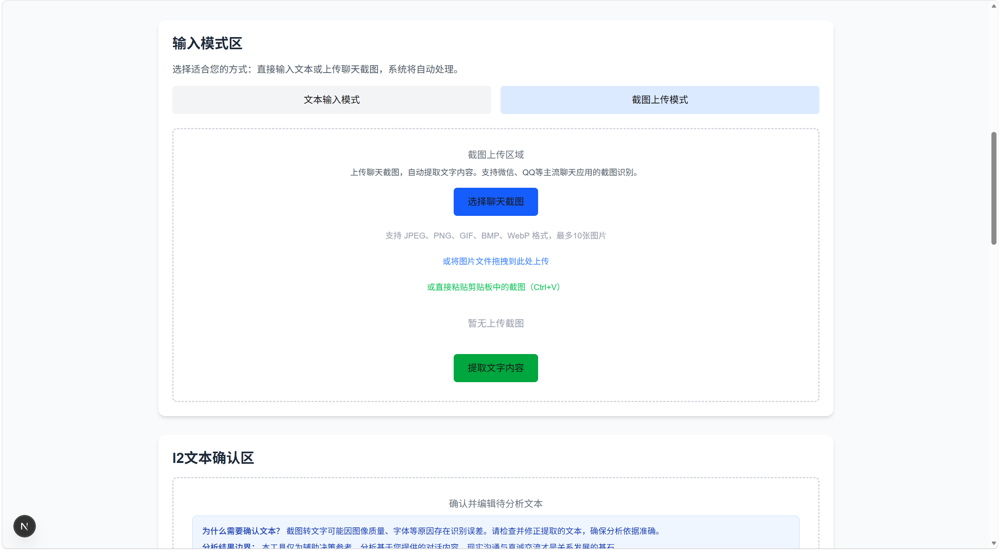
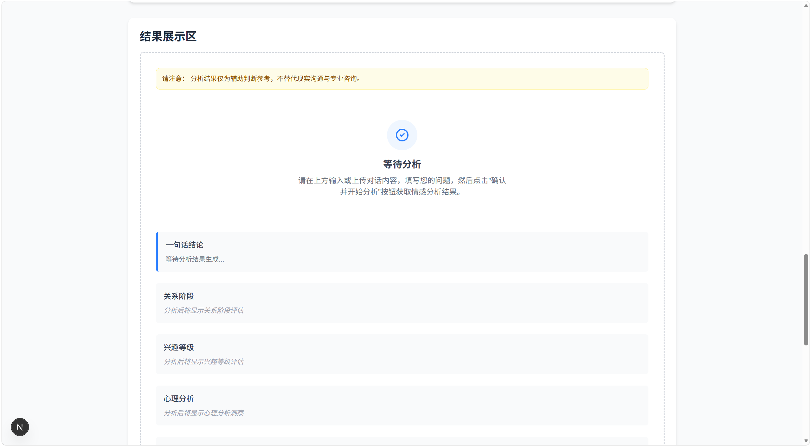

# 💔 LoveAdvisor

> AI 驱动的聊天关系分析与恋爱决策辅助工具
> 从对话中识别关系阶段、兴趣程度，并给出克制、可执行的下一步建议

---

## ✨ What is LoveAdvisor?

LoveAdvisor 是一个面向真实聊天场景的 AI 分析工具。

你只需要：

* 📸 上传聊天截图
* 或 ✍️ 粘贴聊天记录

系统就会帮你分析：

* 现在是什么关系阶段？
* 对方的兴趣程度如何？
* 当前互动存在哪些风险？
* 下一步应该怎么做？

---

## 🚀 Key Features

### 🧠 结构化关系分析

* 关系阶段识别（初识 / 暧昧 / 冷淡等）
* 兴趣等级判断（低 / 中 / 高）
* 基于规则系统（R1），非纯模型拍脑袋

---

### 💬 聊天截图直接分析（核心能力）

```text
截图 → 图转文（I1） → 用户确认（I2） → 分析引擎
```

* 支持上传 / 拖拽 / 粘贴截图
* 自动提取聊天内容
* 自动生成结构化聊天草稿
* 用户可编辑确认，避免误判

---

### 📊 可解释分析结果

输出包含：

* 一句话结论
* 心理分析
* 风险提示
* 行动建议
* 下一步策略

👉 不只是结论，而是告诉你“为什么”

---

### 🔁 完整用户闭环

```text
输入 → 分析 → 结果 → 历史 → 再分析
```

* 支持历史记录查看
* 支持一键重新分析
* 支持修改输入再决策

---

## 🏗️ Architecture (简版)

系统采用分层架构设计：

```text
输入层
├─ 文本输入
└─ 截图输入（I1 图转文）

↓

I2 输入确认层

↓

分析引擎（核心冻结）
PREPROCESS → S2 → S3 → R1 → S5 → GUARDRAIL → OUTPUT

↓

结果展示层
```

### 核心原则：

```text
规则主导决策（R1） + 模型负责表达（S2/S3/S5）
```

---

## 📸 使用示例

### 📝 输入界面（上传聊天截图或粘贴对话）
上传聊天截图，或直接粘贴聊天内容进行分析。



### 📊 分析结果（关系判断 + 行动建议）
系统将输出关系阶段、兴趣等级，并给出下一步建议。



---

## 🛠️ Tech Stack

* **Frontend**: Next.js / React
* **Backend**: FastAPI
* **LLM Provider**: DeepSeek
* **OCR / Vision**: Qwen-OCR
* **Data Storage**: JSONL（轻量级）

---

## ⚡ Quick Start

### 1️⃣ 克隆项目

```bash
git clone https://github.com/your-username/loveadvisor.git
cd loveadvisor
```

---

### 2️⃣ 配置环境变量

复制 `.env.example`：

```bash
cp .env.example .env
```

填写：

```env
DEEPSEEK_API_KEY=your_key
DASHSCOPE_API_KEY=your_key
```

---

### 3️⃣ 启动后端

```bash
uvicorn app.main:app --reload
```

---

### 4️⃣ 启动前端

```bash
cd web
npm install
npm run dev
```

---

### 5️⃣ 打开浏览器

```text
http://localhost:3000
```

---

## 📁 Project Structure

```text
app/            # 后端核心（分析引擎）
web/            # 正式用户端前端（Next.js）
frontend/       # 调试前端（Streamlit）
configs/        # 配置层
test_system/    # 测试体系
scripts/        # 工具脚本
data/           # 运行数据（不入库）
docs/           # 文档与日志
```

---

## ⚠️ Disclaimer

LoveAdvisor 仅作为辅助决策工具：

* ❌ 不保证判断绝对准确
* ❌ 不替代现实沟通
* ❌ 不提供情感操控建议

👉 请理性使用

---

## 🧪 Current Status

```text
V4 Phase 6：真实试用验证阶段
```

当前能力：

* ✅ 输入链路（截图 / 文本）稳定
* ✅ 分析引擎稳定
* ✅ 用户路径闭环完成
* ⚠️ 正在进行真实用户体验验证

---

## 📌 Roadmap

* [ ] OCR识别稳定性优化
* [ ] 多用户数据隔离
* [ ] 分析结果版本管理
* [ ] 产品化UI优化
* [ ] 商业化能力探索

---

## 📄 License

MIT License

---

## 🙌 Contribution

欢迎提出 Issue / PR，一起把这个项目做成一个真正可用的 AI 决策工具 🚀
