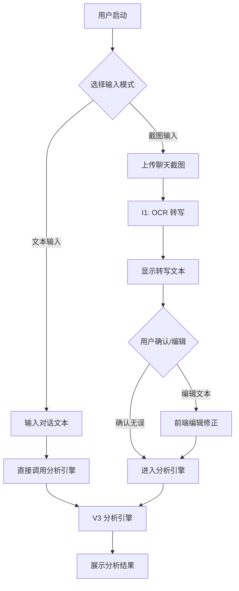

# LoveAdvisor V3.5 Phase 1: 输入层方案冻结

**文档版本**: 1.0  
**冻结日期**: 2026-04-13  
**适用阶段**: V3.5 Phase 1 (输入层)  
**后续依赖**: 前端开发、I1/I2模块开发、分析引擎衔接  

---

## 1. 阶段目标

V3.5 Phase 1 聚焦于 **输入层扩展**，在已有 V3 稳定分析引擎基础上，新增 **截图输入 + 转写确认** 能力，形成双模输入体系：

1. **文本直接输入**：保留现有 `/analyze` 接口的纯文本输入模式
2. **截图转写输入**：新增 OCR 识别 → 转写文本 → 用户确认 → 进入分析的完整流程

**本阶段核心产出**：
- 输入层产品流程冻结（用户视角）
- 截图解析层（I1）与输入确认层（I2）的模块边界定义
- 与 V3 分析引擎的衔接接口规范
- 明确 Phase 1 不做事项，划定后续 Phase 2~4 范围

> **重要约束**：本阶段仅定义流程、边界、接口，不实现功能代码。前端、后端、OCR 服务等实现放在后续 Phase。

---

## 2. 用户输入总流程



**流程说明**：
1. **模式选择**：前端提供两种入口（文本输入框 / 截图上传按钮）
2. **文本路径**：直接使用现有 `/analyze` 接口
3. **截图路径**：
   - 上传图片文件（支持 PNG、JPG 等常见格式）
   - 调用 I1 服务进行 OCR 转写
   - 前端展示转写结果，提供编辑框供用户修正
   - 用户确认后，携带文本调用分析引擎
4. **分析引擎**：统一使用 V3 的 `run_analysis` 函数

---

## 3. 两种输入模式说明

### 3.1 文本输入模式（现有）

| 属性 | 说明 |
|------|------|
| 前端组件 | 多行文本输入框（支持 1000 字以上） |
| 后端接口 | `POST /analyze` （现有接口） |
| 请求格式 | `{"text": "对话文本", "user_question": "用户问题"}` |
| 处理流程 | 直接调用 `run_analysis(chat_text, user_question)` |
| 适用场景 | 用户已有文本内容、从其他应用复制粘贴 |

### 3.2 截图输入模式（新增）

| 属性 | 说明 |
|------|------|
| 前端组件 | 文件上传按钮 + 预览区域 |
| 图片限制 | 最大 5MB，支持 PNG/JPG/JPEG |
| 转写服务 | I1 截图解析层（OCR 服务） |
| 确认界面 | 展示转写文本 + 可编辑文本框 + 确认按钮 |
| 后端接口 | `POST /analyze/from-image` （新增接口） |
| 请求格式 | `{"image_base64": "..."}` → 返回转写文本<br>`{"confirmed_text": "..."}` → 进入分析 |
| 处理流程 | 上传 → OCR → 展示 → 确认 → 分析 |

**截图输入的特殊约束**：
- OCR 准确率非 100%，必须提供用户确认环节
- 支持批量上传（最多 3 张截图），按上传顺序拼接转写结果
- 转写文本需保留原始换行、分隔符（`A:`、`B:` 等说话人标记）
- 前端需提供“重新上传”功能，允许用户放弃当前转写结果

---

## 4. 截图输入页面流转说明

### 4.1 页面状态机

```
[截图上传页] → [转写中态] → [文本确认页] → [分析结果页]
      ↑              |             ↑
      └────[重新上传]←┘      └─[编辑后确认]─┘
```

### 4.2 各页面要素

**页面 1：截图上传页**
- 文件上传区域（拖拽或点击）
- 格式提示（PNG/JPG，≤5MB）
- 已上传图片缩略图（可删除）
- “开始转写”按钮（禁用状态直到有图片）

**页面 2：转写中态**
- 加载动画 + 进度提示（预计 3-5 秒）
- 可取消操作（返回上传页）

**页面 3：文本确认页**
- **左侧**：截图预览（半透明蒙层+OCR 高亮？暂不实现）
- **右侧**：
  - 转写文本显示区（可编辑的 textarea）
  - 字数统计、说话人标记高亮
  - 操作按钮：“确认并分析”、“重新上传”、“手动输入”
- **底部**：原始图片列表（可切换查看）

**页面 4：分析结果页**
- 复用现有 V3 结果页（不修改）
- 增加“返回编辑”入口（如需修正输入）

---

## 5. 中间确认机制：“自动转写 → 用户确认 → 进入分析”

### 5.1 设计原则

1. **不可跳过确认**：OCR 结果必须经用户确认方可进入分析引擎
2. **可编辑性**：提供完整文本编辑能力，非仅“接受/拒绝”
3. **历史记录**：保存原始 OCR 结果与用户修正后的版本（用于后续 OCR 模型优化）
4. **降级处理**：如 OCR 服务失败，提供手动输入入口

### 5.2 数据流

```
前端上传图片
    ↓
调用 I1 接口（OCR）
    ↓
返回转写文本 + 置信度分数
    ↓
前端展示（标注低置信度片段）
    ↓
用户编辑/确认
    ↓
调用 I2 接口（文本清洗）
    ↓
返回标准化文本
    ↓
调用现有 /analyze 接口
```

### 5.3 确认界面交互细节

- **置信度可视化**：低置信度字符用浅红色背景标出（可选）
- **说话人分离**：自动检测 `A:`、`B:`、`【】` 等标记，分行显示
- **编辑辅助**：提供“清空”、“恢复原始”、“格式化”按钮
- **分析上下文**：保留 `user_question` 输入框（用户可补充问题）

---

## 6. I1 截图解析层职责边界

### 6.1 核心职责

1. **图像预处理**
   - 格式验证（文件头检查）
   - 尺寸调整（长边 ≤ 2000px，保持比例）
   - 图像增强（对比度、二值化等）

2. **OCR 转写**
   - 调用第三方 OCR 服务（如百度 OCR、腾讯 OCR）
   - 支持中文、英文、常见符号
   - 识别说话人标记（`A:`、`B:`、`[xxx]` 等）

3. **文本后处理**
   - 去除明显噪声字符
   - 合并断行（根据上下文）
   - 输出置信度分数（按字符/按区域）

### 6.2 接口定义

```python
# 请求
POST /api/v1/ocr/translate
{
    "image_base64": "data:image/png;base64,...",
    "language": "zh"  # 可选，默认中文
}

# 响应
{
    "success": true,
    "text": "A: 你好吗？\nB: 我很好，谢谢！",
    "confidence": 0.92,
    "segments": [
        {"text": "A: 你好吗？", "confidence": 0.95, "bbox": [x1,y1,x2,y2]},
        {"text": "B: 我很好，谢谢！", "confidence": 0.89, "bbox": [x1,y1,x2,y2]}
    ],
    "language": "zh"
}
```

### 6.3 边界约束

- **不做**：情感分析、内容理解、关键信息提取
- **不做**：多图关联分析（仅独立处理每张图）
- **不做**：非聊天截图识别（如风景、文档）
- **输出**：纯文本 + 置信度，不附加任何业务逻辑

---

## 7. I2 输入确认与清洗层职责边界

### 7.1 核心职责

1. **文本标准化**
   - 统一说话人标记（`A:` → `A：`，`【A】` → `A：`）
   - 规范化标点（英文标点 → 中文标点）
   - 去除无关字符（时间戳、系统通知等）

2. **长度验证**
   - 最短长度 ≥ 10 字符（否则提示输入不足）
   - 最长长度 ≤ 5000 字符（否则截断提示）

3. **格式检查**
   - 是否包含至少两个说话人
   - 是否包含对话内容（非纯表情/符号）

4. **用户修正记录**
   - 记录原始 OCR 文本
   - 记录用户编辑后的文本
   - 差异分析（用于后续 OCR 优化）

### 7.2 接口定义

```python
# 请求（清洗）
POST /api/v1/text/clean
{
    "raw_text": "A: 你好吗？\nB: 我很好!",
    "source": "ocr"  # or "direct_input"
}

# 响应
{
    "cleaned_text": "A：你好吗？\nB：我很好！",
    "changes_made": [
        {"type": "speaker_marker", "from": "A:", "to": "A："},
        {"type": "punctuation", "from": "!", "to": "！"}
    ],
    "validation": {
        "has_two_speakers": true,
        "word_count": 6,
        "is_valid": true
    }
}
```

### 7.3 边界约束

- **不做**：内容真实性判断（用户可能输入虚构对话）
- **不做**：语义理解、信号提取（属分析引擎范畴）
- **不做**：个性化过滤（如屏蔽敏感词，由后续 Guardrail 处理）
- **输出**：标准化文本 + 变更记录 + 验证结果

---

## 8. 与现有 V3 分析引擎的衔接方式

### 8.1 接口衔接

**现有分析接口**：
```python
# app/core/pipeline_orchestrator.py
def run_analysis(chat_text: str, user_question: str, provider_name: str = "mock", debug: bool = False) -> Dict[str, Any]
```

**衔接方案**：
1. 文本输入模式：直接调用 `run_analysis(text, user_question)`
2. 截图输入模式：`I1 → I2 → run_analysis(cleaned_text, user_question)`

**新增接口**（Phase 1 仅定义，不实现）：
```python
# 建议新增在 app/api/analyze.v3.py 或扩展现有 analyze.v2.py
@router.post("/analyze/from-image")
async def analyze_from_image(
    image: UploadFile = File(...),
    user_question: Optional[str] = Form("")
):
    """
    1. 保存图片临时文件
    2. 调用 I1 OCR 服务
    3. 返回转写文本（前端用于确认）
    """
    pass

@router.post("/analyze/confirmed-text")
async def analyze_confirmed_text(
    confirmed_text: str = Body(...),
    user_question: Optional[str] = Body("")
):
    """
    1. 调用 I2 清洗服务
    2. 调用 run_analysis
    3. 返回分析结果
    """
    pass
```

### 8.2 数据流衔接

```
用户截图 → 前端 → I1 (OCR) → 前端展示 → 用户确认
                                      ↓
                              I2 (清洗) → run_analysis → 结果
```

### 8.3 错误处理衔接

- **I1 失败**：返回错误码，前端降级为手动输入
- **I2 验证失败**：返回具体原因（如“未检测到两个说话人”），前端提示用户修改
- **run_analysis 失败**：沿用现有 V3 错误处理（返回兜底结果）

### 8.4 上下文传递

- **user_question**：从输入层一直传递到分析引擎
- **source_tag**：标记来源（`screenshot` / `direct_text`），用于分析引擎统计
- **ocr_confidence**：可选传递，供分析引擎参考（低置信度时降低结果权重？暂不实现）

---

## 9. 本阶段明确不做事项

### 9.1 输入层之外的功能

1. **结果页改造**：Phase 1 不修改分析结果展示页
2. **历史记录**：不实现输入历史保存、回看功能
3. **用户系统**：不实现登录、个人中心、偏好设置

### 9.2 高级 OCR 能力

1. **多语言混合**：仅支持中文为主，少量英文
2. **手写体识别**：仅支持印刷体、屏幕字体
3. **复杂版面分析**：仅支持常规聊天截图（垂直对话流）
4. **视频/语音输入**：仅支持静态图片

### 9.3 智能处理

1. **自动分段**：不实现基于语义的智能对话分割
2. **说话人识别**：不实现基于头像/名字的说话人关联
3. **内容摘要**：不实现输入内容自动摘要
4. **敏感信息过滤**：由后续 Guardrail 统一处理

### 9.4 性能优化

1. **实时预览**：不实现 OCR 实时边识别边显示
2. **离线 OCR**：不实现本地 OCR 模型嵌入
3. **批量处理**：不支持同时上传 >3 张截图

---

## 10. 后续 Phase 2 ~ Phase 4 的衔接说明

### Phase 2：前端实现与基础接入
- 实现截图上传页面、转写确认页面
- 对接 I1/I2 服务（Mock 版本）
- 对接现有分析引擎（不变）
- **交付物**：可用的双模输入前端

### Phase 3：OCR 服务接入与优化
- 接入真实 OCR 服务（百度/腾讯 OCR）
- 实现图像预处理管道
- 优化转写准确率（基于用户修正数据）
- **交付物**：生产可用的 I1 服务

### Phase 4：输入层增强与产品化
- 批量截图支持（>3 张）
- 输入历史记录
- 用户偏好（常用说话人标记）
- 高级清洗规则（基于业务反馈）
- **交付物**：完整输入层产品体验

---

## 11. 附录：术语表

| 术语 | 全称 | 说明 |
|------|------|------|
| I1 | Input Layer 1 - Screenshot Parser | 截图解析层，负责 OCR 转写 |
| I2 | Input Layer 2 - Input Confirmation & Cleaning | 输入确认与清洗层，负责文本标准化 |
| OCR | Optical Character Recognition | 光学字符识别，将图片文字转为文本 |
| 置信度 | Confidence Score | OCR 对识别结果的置信程度，0~1 |
| 说话人标记 | Speaker Marker | 标识说话人的前缀，如 `A:`、`B:`、`【】` |
| 清洗 | Text Cleaning | 文本标准化过程，包括标点、标记统一等 |

---

## 12. 变更记录

| 版本 | 日期 | 修改说明 | 修改人 |
|------|------|----------|--------|
| 1.0 | 2026-04-13 | 初始版本，冻结 Phase 1 输入层方案 | Claude Code |
